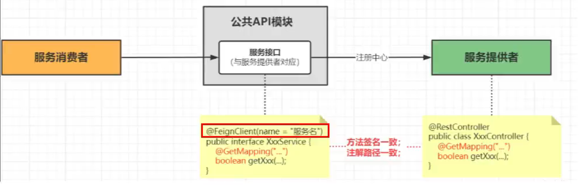

[TOC]

# Spring Cloud

## 架构

### 单体架构

在了解微服务之前，首先了解下我们平时使用的单体结构：将业务的所有功能集中开发在一个项目中，打包成一个包部署。
单体架构简单、部署成本低，但是团队开发协作成本高，系统效率低，可用性差。适合开发功能简单，规模小的项目。

### 微服务架构

是服务化思想指导下的一套最佳实践架构方案。服务化，就是把单体架构中的功能模块拆分为多个独立项目。每个项目都在不同的独立环境中运行。粒度小、团队自治，服务自治。


## 学习版本

项目demo学习课程[尚硅谷2024最新SpringCloud教程，springcloud从入门到大牛_哔哩哔哩_bilibili](https://www.bilibili.com/video/BV1gW421P7RD/?spm_id_from=333.1007.top_right_bar_window_custom_collection.content.click&vd_source=f910f291916244672e3ab84e2dba2c6a)

spring cloud涉及到各种组件，各种组件之间和spring cloud的关系必须正确。本次学习使用版本：

```tex
Java: Java17+
cloud: 2023.0.0
boot: 3.2.0
cloud alibaba: 2022.0.0.0
Maven: 3.9+
Mysql: 8.0+
```

spring cloud和boot有版本依赖要求，创建项目前先去官网看看boot[版本](https://spring.io/projects/spring-cloud)

#### 2024spring cloud推荐使用的组件


#### 微服务模块步骤

1. 建module
2. 改pom
3. 写yml
4. 主启动
5. 业务类


## 项目结构

- pom父项目
- 工具模块
- 服务模块


## 服务间调用

### RestTemplate

RestTemplate是Spring框架中用于简化与RESTful进行交互的工具类。它提供了一组便捷的方法，用于发送HTTP请求并处理。RestTemplate是一个同步客户端，会阻塞调用线程，用于处理同步HTTP请求。[RestTemplate 最详解 - 程序员自由之路 - 博客园 (cnblogs.com)](https://www.cnblogs.com/54chensongxia/p/11414923.html)


## 服务注册和发现

### 作用

> **服务注册**：
>
> - **集中管理服务实例**：每个微服务在启动时会向服务注册中心（例如Eureka、Consul、Zookeeper）注册自己的地址、端口等信息。这样，服务注册中心可以维护一个服务实例的目录。
> - **动态管理**：服务实例可以动态注册和注销，服务注册中心会及时更新这些信息，从而实现服务实例的动态管理。
>
> **服务发现**：
>
> - **客户端负载均衡**：服务消费者（客户端）可以从服务注册中心获取服务提供者的实例列表，并通过负载均衡算法（例如Ribbon）选择一个实例进行调用。这样可以实现客户端负载均衡，分散请求压力。
> - **服务透明**：服务消费者不需要知道服务提供者的具体地址，只需要通过服务名来请求，简化了服务调用的过程。
>
> **高可用性**：
>
> - **故障恢复**：服务注册中心通常具有高可用性设计，可以在某个服务实例故障时，自动移除故障实例，并将请求路由到其他可用实例，提高系统的可靠性。
> - **监控和报警**：服务注册中心可以实时监控各个服务实例的健康状况，并在发现异常时发送报警通知，便于及时处理。
>
> **解耦与扩展**：
>
> - **服务解耦**：通过服务注册和发现，服务消费者与服务提供者之间不再直接耦合，可以独立部署和升级，提升了系统的灵活性。
> - **横向扩展**：当某个服务需要扩展时，只需增加实例并注册到服务中心，消费者可以自动发现并使用新的实例，便于服务的横向扩展。


### **Consul：服务注册和服务配置**

[Spring Cloud Consul](https://spring.io/projects/spring-cloud-consul)

[Consul by HashiCorp](https://www.consul.io/)

### 服务注册

#### 基础使用步骤

1. 下载consul
2. 运行consul: consul agent -dev
3. 模块pom引入consul服务注册包
4. 配置文件添加spring.cloud.consul配置
5. 需要请求其它微服务的url修改成对应服务名
6. 启动类添加@EnableDiscoveryClient注解加入consul服务发现

####  consul原生支持负载均衡LoadBalancer

##### @LoadBalanced

创建RestTemplate实例时需要带有`@LoadBalanced`注解。

```java
    @Bean
    @LoadBalanced //赋予RestTemplate对象负载均衡能力
    public RestTemplate restTemplate(){
        return new RestTemplate();
    }
```

`@LoadBalanced`注解原理：
`@LoadBalanced`注解会触发Spring Cloud的自动配置，给`RestTemplate`实例添加一个自定义的拦截器。这个拦截器会拦截`RestTemplate`发出的HTTP请求，并使用一个负载均衡的客户端来处理这些请求。默认情况下，这个负载均衡客户端是基于Netflix Ribbon。


##### 负载均衡原理

consul是在*客户端负载均衡*，客户端通过DiscoveryClient获取请求服务的服务信息（实例数），客户端通过算法计算当前应该请求哪一个服务端实例，默认算法是轮询服务端进行请求，当前客户端访问了服务端1，下一次访问服务端2。

> 客户端负载均衡
> 优点：有一定的负载均衡能力、客户端可以灵活配置负载均衡算法，确保流量被均匀地分配到可用的服务实例上，以实现高可用性和弹性；
> 缺点：负载均衡能力较弱，无法精准监控和分配流量。

##### 负载均衡算法替换

默认负载均衡和算法是轮询算法，且可供选择随机算法，大部分情况下轮询算法足够，可以自定义算法（比如存在大小服务器的情况下）

通过实现`ReactorServiceInstanceLoadBalancer`接口自定义算法

### 分布式服务配置

#### 基础使用步骤

1. 在服务注册基础上

2. 引入cnosul服务配置包

3. 在consul上创建环境配置文件

4. 模块创建`bootstarp.yml`文件配置启动项

5. `application.yml`指定配置环境

   > bootstarp.yml（系统级）是springCloud项目的父配置文件，比application.yml（用户级）更早加载，且无法被覆盖；
   >
   > 主要用于从额外的资源来加载配置信息

#### consul服务配置支持动态配置

不需要重新启动项目，修改data配置文件内容，即可实现配置修改。修改consul监控间隔时间，可以改变修改配置文件后在项目中同步的时间。

注意：服务配置需要进行持久化，否则服务重启后文件会删除


## 服务调用和负载均衡

### Openfeign

#### 简单入门

[Spring Cloud OpenFeign](https://spring.io/projects/spring-cloud-openfeign)

一个声明式REST客户端。使用`@FeignClient`注解声明一个api接口，使用一个spirngboot项目封装接口，实现请求接口和其它微服务解耦，相当于一个公共api模块。
OpenFeign集成LoadBalancer，支持负载均衡



解决问题：对于各服务间的服务依赖，不同项目开发时接口散乱，难以维护和管理

#### Openfeign基本使用步骤

1. 公共模块中引入spring-cloud-starter-openfeign依赖
2. 在commons公共模块中定义@FeignClient api接口
3. 在客户端模块内组合feign客户端接口，实现业务接口调用
4. 改yml
5. 启动类@EnableFeignClients开启openfeign功能

#### @FeignClient

接口定义：
使用`@FeignClient`注解定义一个接口，该接口表示需要调用的远程服务。

```java
@FeignClient(value = "cloud-user8080")
public interface AccountFeignApi {
    @GetMapping("/tAccount")
    Resp<List<AccountVO>> getAccount();

    @GetMapping("/tAccount/{id}")
    Resp<AccountVO> queryById(@PathVariable("id") String id); //@PathVariable注解上需要指定路径参数名，不然启动报错
}
```

这个接口中的方法映射到远程服务的HTTP端点。

动态代理生成：
在应用启动时，Spring Cloud会扫描带有`@FeignClient`注解的接口，并使用Feign创建这个接口的代理对象。Feign使用JDK动态代理生成接口的实现类，这个实现类会在方法调用时构造HTTP请求。

负载均衡与服务发现：
Feign会通过Ribbon（客户端负载均衡器）从consul（服务发现组件）获取目标服务的实例列表，并根据负载均衡策略选择一个实例进行请求

#### 超时控制

openfeign默认超时连接时间和等待结果超时时间为60秒，修改客户端超时时间

```yaml
spring:
	cloud:
		openfeign:
		      client:
                  default: # 修改全局客户端超时时间
                    connect-timeout: 4000
                    read-timeout: 4000
                  cloud-user8080: # 针对某个客户端的超时时间，可以同default共存
                    connect-timeout: 8000
                    read-timeout: 8000
```

#### 重试机制

```java
    @Bean
    public Retryer retryer() {
        // 初始间隔时间100ms，重试间隔时间最大1s，最多请求3次
        return new Retryer.Default(100, 1, 3);
    }
```

#### 使用Apache httpClient5

openfeign中默认http client是jdk自带的httpURLconnecttion

使用httpClient5优化性能，是springcloud官方推荐的http客户端，自带连接池

导入httpclient5和加入feign支持hc5的包

```xml
<dependency>
    <groupId>org.apache.httpcomponents.client5</groupId>
    <artifactId>httpclient5</artifactId>
    <version>5.3.1</version>
</dependency>
<dependency>
    <groupId>io.github.openfeign</groupId>
    <artifactId>feign-hc5</artifactId>
    <version>13.3</version>
</dependency>
```

修改yml开启hc5支持

```yaml
spring:
	cloud:
		openfeign:
			httpclient:
				hc5:
					enabled: true
```

#### 请求压缩

[Spring Cloud OpenFeign 特性 ：： Spring Cloud Openfeign](https://docs.spring.io/spring-cloud-openfeign/reference/spring-cloud-openfeign.html#spring-cloud-feign-inheritance)

以gzip形式压缩服务间请求大小，优化网络请求传输速度，减少性能损耗。

#### logger请求日志

[Spring Cloud OpenFeign 特性 ：： Spring Cloud Openfeign](https://docs.spring.io/spring-cloud-openfeign/reference/spring-cloud-openfeign.html#feign-logging)

通过开启请求日志来查看分析请求细节


## 服务熔断和降级

### 概念解析

#### 服务熔断

[什么是服务熔断？什么是服务降级？-腾讯云开发者社区-腾讯云 (tencent.com)](https://cloud.tencent.com/developer/article/2365271)

在一个完整的微服务系统中，当一个微服务出现故障或不可用时，为了保护整个系统的可用性，迅速切断故障服务的请求处理，而不继续加大微服务负载，把请求通过服务兜底处理或者其它微服务处理，类似电闸，当电流过大时切断电路，防止电器和整个电路的损毁。

#### 服务降级

服务降级可以临时关闭一些非核心的功能，比如活动推荐、个性化推荐等，以确保网站的下单、支付等核心功能可以正常运行，保证用户购物体验，对于不可用的功能返回fallback。


### Spring Cloud Circuit breaker（断路器）

断路器为微服务系统提供服务熔断、服务降级、限时、限流等操作。

Spring Cloud Circuit breaker 提供了跨不同断路器实现的抽象。它提供了一个一致的 API，供您在应用程序中使用，使开发人员能够选择最适合您的应用需求的断路器实现。

#### 断路器三大状态

 

- 断路器的三个普通状态：关闭（closed）、开启（open）、半开（half_open）
  两个特殊状态：禁用（disabled）、强制开启（forced_open）。

- 状态转换
  - 当熔断器关闭时，所有请求都会通过熔断器
  - 如果失败率超过设定阈值，熔断器从关闭状态转换为开启状态
  - 一段时间后，熔断器从打开状态到半开状态，此时会有少量请求进入，重新计算失败率
  - 如果失败率低于阈值，从半开状态到关闭状态，否则返回打开状态。
- 请求失败率统计使用滑动窗口，可以基于调用数量的滑动窗口或者基于时间的滑动窗口。
- 两种特殊状态，不会生成熔断器事件（除状态转换外），并且不会记录事件的成功和失败，退出特殊状态的唯一方法是触发状态转换或者重置熔断器。

#### 断路器实现

- Resilience4j
- spring retry


### bulkhead 舱壁机制

#### 基本概念

舱壁机制灵感来自船只结构中的隔舱设计，这些隔舱可以防止船体进水时导致整个船只下沉。在舱壁机制中，系统资源（如线程、内存、连接等）被划分为多个隔离的区域，每个区域负责处理不同的任务或服务请求。这种隔离可以防止某个区域的故障（如资源耗尽）影响到其他区域，从而提高系统的整体稳定性。

限制下游服务的最大并发数量。


#### 实现舱壁的两种实现方式

1. 信号量隔离（Semaphore Bulkhead）：通过信号量的总量来限制并发请求数
2. 线程池隔离（Thread Pool Bulkhead）：每个服务或任务使用独立的线程池和消息队列，线程池和队列大小限制并发请求数

>底层技术都是juc并发相关

### RateLimiter 限流器

#### 基本概念

Spring Cloud 提供了一些限流（Rate Limiting）解决方案，以帮助开发者控制应用程序的流量，从而避免过载和保护服务的稳定性

#### 常见限流算法

- 漏洞算法
- 令牌桶算法：springcloud默认算法
- 滚动时间窗算法
- 滑动事件窗口


### 断路器、舱壁和限流器的区别

三者都是常见的用于提高系统稳定性和弹性的技术，各自有不同的功能和应用场景。

- 断路器：检测系统故障，当服务**失败率**高时，断开对该服务的调用。
  场景：
  - 当某个依赖服务响应时间过长或不可用时，防止对该服务的持续调用，保护系统资源。
  - 提供快速失败（fail-fast）机制，提高系统的响应速度。
- 舱壁：将不同的服务调用**隔离**在不同的线程池、信号量或其他隔离机制中，以避免一个服务的故障或慢响应影响其他服务的性能和稳定性。
  场景：
  - 避免服务之间的相互影响，提高系统的可靠性。
  - 为不同的服务设置不同的资源限制，防止资源竞争。
- 限流器：控制服务的请求**速率**，以防止系统过载，保证服务的稳定性和可用性。
  场景：
  - 防止流量突发导致系统过载。
  - 为不同的服务或用户分配公平的资源使用率。


### Resilience4j

[Configuring Resilience4J Circuit Breakers :: Spring Cloud Circuitbreaker](https://docs.spring.io/spring-cloud-circuitbreaker/reference/spring-cloud-circuitbreaker-resilience4j.html)

[Resilience4j中文文档](https://github.com/lmhmhl/Resilience4j-Guides-Chinese?tab=readme-ov-file)

#### CircuitBreaker 断路器熔断

##### 基本使用步骤

1. 导入Resilience4j：spring-cloud-starter-circuitbreaker-resilience4j；
   熔断保护等基于aop实现：spring-cloud-starter-aop
   
2. 改yml

   ```yaml
   # openfeign开启使用断路器
   spring:
   	cloud:
   		openfeign:
   			circuitbreaker:
   				enabled: true
   			group:
   				enable: true
   				
   # 断路器实现resilience4j配置
   resilience4j:
     circuitbreaker:
       configs:
         default: # 可以定义一堆配置单
           failureRateThreshold: 50
           slidingWindowType: count_based
           slidingWindowSize: 6
           minimumNumberOfCalls: 6
           automaticTransitionFromOpenToHalfOpenEnabled: true
           waitDurationInOpenState: 5s
           permittedNumberOfCallsInHalfOpenState: 2
           recordExceptions:
             - java.lang.Exception
       instances:
         cloud-demo-8080: # 断路器实例
           base-config: default # 上方配置单名
     timelimiter:
       configs:
         default:
           timeoutDuration: 10s # 请求超时时间，超时就走fallback方法
   ```

3. 在需要断路器的请求方法上使用`@CircuitBreaker`注解，并且标明断路器实例和服务降级fallback方法

4. 定义fallback方法

#### bulkhead 舱壁

[Bulkhead (readme.io)](https://resilience4j.readme.io/docs/bulkhead)

##### 基本使用

1. 导入依赖resilience4j-bulkhead
2. 添加yml配置
3. 舱壁方法加上`@Bulkhead`

##### Semaphore Bulkhead 信号量隔离

yml配置：

```yaml
resilience4j:
	bulkhead:
		config:
        	maxConcurrentCalls: 3 # 最大信号量(并发)
       		maxWaitDuration: 500ms # 最大等待时间,拿不到信号就走服务降级
    	instances:
      		cloud-demo-8080:
        		baseConfig: configA
```

请求上`@Bulkhead`

```java
    @GetMapping("/semaphorebulkhead/{id}")
    @Bulkhead(name = "cloud-demo-8080", fallbackMethod = "fallback", type = Bulkhead.Type.SEMAPHORE)
    public Resp<String> semaphoreBulkheadTest(@PathVariable("id") String id) {
        return api.bulkheadTest(id);
    }
```

##### Thread Pool Bulkhead 线程池隔离

使用线程池隔离的顶层处理方法中需要返回异步操作对象，一般使用CompletableFuture，这个对象表示即将进行的异步方法，异步方法返回后被resilience4j隔离的线程池拿到，线程池执行这个返回的异步方法，并且返回响应。

```yaml
resilience4j:
	thread-pool-bulkhead:
		    instances:
      			cloud-demo-8080B:
                    coreThreadPoolSize: 1 # 核心线程数
                    maxThreadPoolSize: 1 # 最大线程数
                    queueCapacity: 1 # 队列容量
# 使用线程池隔离需要把spring.cloud.openfeign.circuitbreaker.group.enable设置为false？实验过这个好像是没有影响的                    
```

```java
    @GetMapping("/threadPoolBulkhead/{id}")
    @Bulkhead(name = "cloud-demo-8080B", fallbackMethod = "poolFallback", type = Bulkhead.Type.THREADPOOL)
    public CompletableFuture<Resp<String>> threadPoolBulkheadTest(@PathVariable("id") String id) {
        return CompletableFuture.supplyAsync(() -> {
            Resp<String> stringResp = api.bulkheadTest(id);
            stringResp.setData(stringResp.getData() + "\t" + Thread.currentThread().getName());
            return stringResp;
        });
    }

    public CompletableFuture<Resp<String>> poolFallback(String id, Throwable t) {
        return CompletableFuture.supplyAsync(() -> Resp.error("服务器炸了，无法处理：id：" + id));
    }
```

#### RateLimiter 限流器

##### 基本使用步骤

1. 导入依赖 resilience4j-ratelimiter

2. 修改yml

   ```yaml
   resilience4j:
   	ratelimiter:
   		instances:
   			instaceName:
                   limitForPeriod: 2 # 刷新时间内最大请求数
                   limitRefreshPeriod: 1s # 刷新时间
                   timeoutDuration: 500ms # 线程等待时间
   ```

3. 使用`@RateLimiter`注解

   ```java
       @GetMapping("/{id}")
       @RateLimiter(name = "cloud-demo-8080C", fallbackMethod = "fallback")
       public Resp<String> rateTest(@PathVariable("id") String id) {
           return api.bulkheadTest(id);
       }
   
       public Resp<Object> fallback(String id, Throwable t) {
           return Resp.error("错误").setData("服务炸了老弟");
       }
   ```


## 服务链路追踪

### 概述

Spring Cloud 的分布式链路追踪（Distributed Tracing）主要是为了监控和追踪在分布式系统中每个请求的路径及其相关的调用关系。这对于调试、性能优化、故障诊断等非常重要。

通常来讲，分布式跟踪是一种在分布式系统和微服务中传播的请求，生成有关这些请求的高质量数据，并使其可供分析的方法。

### 追踪原理

#### 追踪模型

- **Trace（追踪）**：表示一个请求的生命周期，可以跨越多个服务。每个 trace 由一个唯一的 Trace ID 标识。
- **Span（跨度）**：表示一个工作单元或操作，是 trace 的一个子单元。每个 span 有一个唯一的 Span ID。一个 trace 可以包含多个 span，它们形成一个树状结构。

- **Annotations（注解）**：标记事件，例如 span 的开始和结束时间、关键事件等。

- **Tags（标签）**：键值对形式的元数据，用于记录额外的信息，例如 HTTP 状态码、URL、服务名等。

#### Trace Context（追踪上下文）

基于追踪模型实现，需要传递 Trace Context，包括 Trace ID 和 Span ID等。这些信息通常通过 HTTP Headers 或者其他协议的元数据传递。


### Micrometer

#### 概述

[概念 micrometer.io](https://docs.micrometer.io/micrometer/reference/concepts.html)

Spring Cloud Micrometer是一个用于度量和监控的库，集成了Spring Cloud生态系统。Micrometer为开发者提供了一种统一的方式来收集和导出度量数据。

#### 基本使用步骤（分布式追踪）

- 在父项目中引入依赖版本：

```properties
# 导入链路追踪版本中心
micrometer-tracing-bom : 
# 请求追踪
micrometer-tracing :
# 应用追踪
micrometer-observation
# 与Brave（一个分布式追踪库）的集成
micrometer-tracing-bridge-brave
```

```properties
# 本项目使用的openfeign和micrometer的集成
feign-micrometer
# 以及下一节的zipkin追踪数据可视化
zipkin-reporter-brave
```


- yml配置

  ```yaml
  management:
  	tracing: 
  		sampling:
  			probability: 1.0 # 采样率，1为100%
  	zipkin:
  		tracing:
  			endpoint: http://localhost:9411/api/v2/spans # zipkin监控平台请求接口
  ```

  

### zipkin

[OpenZipkin · A distributed tracing system](https://zipkin.io/)

#### 概述

zipkin是一个可视化的分布式链路追踪平台，可以和Micrometer集成，通过Micrometer采集的数据进行可视化。


## 服务网关（GateWay）

[Spring Cloud GateWay](https://spring.io/projects/spring-cloud-gateway#overview)

[Spring Cloud Gateway 中文文档 (springdoc.cn)](https://springdoc.cn/spring-cloud-gateway/)

### 概述

Spring Cloud Gateway 是 Spring 生态系统中的一个项目，它用于为微服务架构提供 API 网关功能。API 网关是一个服务器，作为系统中所有微服务的入口点。它的主要功能包括请求路由、负载均衡、限流、监控和安全等。


### 三大核心

- **Route（路由）**：网关的基本构件。它由一个ID、一个目的地URI、一个断言（Predicate）集合和一个过滤器（Filter）集合定义。如果集合断言为真，则路由被匹配。
- **Predicate（谓词）（断言）**: 这是一个 [Java 8 Function Predicate](https://docs.oracle.com/javase/8/docs/api/java/util/function/Predicate.html)。输入类型是 [Spring Framework `ServerWebExchange`](https://docs.spring.io/spring/docs/5.0.x/javadoc-api/org/springframework/web/server/ServerWebExchange.html)。这让你可以在HTTP请求中的任何内容上进行匹配，比如header或查询参数。
- **Filter（过滤器）**: 路由（Route）过滤器（Filter）允许以某种方式修改传入的 HTTP 请求或传出的 HTTP 响应。

### 如何工作？

客户端向 Spring Cloud Gateway 发出请求。如果Gateway处理程序映射确定一个请求与路由相匹配，它将被发送到Gateway Web处理程序。这个处理程序通过一个特定于该请求的过滤器链来运行该请求。过滤器被虚线分割的原因是，过滤器可以在代理请求发送之前和之后运行逻辑。所有的 `"pre"` （前）过滤器逻辑都被执行。然后发出代理请求。在代理请求发出后，`"post"` （后）过滤器逻辑被运行。


### 使用

1. 新建网关模块
2. 引入相关依赖和网关依赖：spring-cloud-starter-gateway
3. **编写yml文件**
4. 对外暴露的模块统一访问网关

### route 路由配置

```yaml
# route路由
spring:
	cloud:
		gateway:
			routes:
				- id: cloud-openfeign-client8090 # 路由id，路由的唯一标识
				  # uri: http://localhost:8090 # 写死服务地址
				  uri: lb://cloud-openfeign # lb标识负载均衡，从服务注册中心中发现服务
				  predicates: # 转发条件
				  - Path=/feign/**
```

### Predicate 断言

除了官网上已定义的route predicate工厂，还可以自定义路由谓词工厂。

观察官方已定义的工厂类（`AfterRoutePredicateFactory`，`PathRoutePredicateFactory`等）不难看出，命名规则是`xxRoutePredicateFactory`，使用时在predicates中使用xx来指定匹配规则。

```java
// MyRoutePredicateFactory.class
@Component
public class MyRoutePredicateFactory extends AbstractRoutePredicateFactory<MyRoutePredicateFactory.Config> {
    public MyRoutePredicateFactory() {
        super(Config.class); // 父类初始化config对象
    }

    // 断言判断规则
    @Override
    public Predicate<ServerWebExchange> apply(Config config) {
        return new GatewayPredicate() {
            @Override
            public boolean test(ServerWebExchange serverWebExchange) {
                int grade = Integer.
                    parseInt(Objects
                             .requireNonNull(serverWebExchange
                                             .getRequest()
                                             .getQueryParams()
                                             .getFirst("grade")));
                return grade > config.getGrade();
            }
        };
    }

    // 支持短促方式配置
    @Override
    public List<String> shortcutFieldOrder() {
        return Collections.singletonList("grade");
    }

    // 这里定义需要配置的参数
    @Getter@Setter
    public static class Config {
        public Config() {
        }

        @NotNull
        private Integer grade;
    }
}
```

```yaml
predicates:
	- name: My # 完全展开模式
	  args:
	  grade: 100
              
predicates:
	- My=100 # 支持短促模式后支持短促写法
            
```

### Filter 过滤器

[Spring Cloud Gateway 中文文档 (springdoc.cn)](https://springdoc.cn/spring-cloud-gateway/#gatewayfilter-工厂)

官网中有很多关于filter的使用，包括了一些请求、响应的各种修改，还有一些其它的配置。

简单演示添加一个请求头和响应头

```yaml
        - id: cloud-openfeign-filter
          uri: lb://cloud-openfeign
          predicates:
            - Path=/filter/**
          filters:
            - AddRequestHeader=X-Request-info, filter
            - AddResponseHeader=X-Response-info, filter
```

请求后成功添加上目标信息

###### 

###### 

#### 自定义GlobalFilter

继承`GlobalFilter`接口，自己看吧，课程这里没讲仔细，涉及到mono响应式编程和chain链的内容

[Java ProjectReactor 响应式编程 Mono 简单工作流程解析_java mono-CSDN博客](https://blog.csdn.net/huachangzai/article/details/128844427)

#### 自定义条件Filter

这个和自定义断言的流程差不多，也不多说，用的时候再去看吧


# 课程总结

本套课程学习了springcloud项目结构，还有集成组件的使用。本课程时间比较断，重点在组件的介绍和简单使用方面，对于其原理层面涉及到的知识很少。介于以上原因，关于本课程88集开始的spring cloud alibaba部分放弃在本次课程的学习中，下次学习时找专门的alibaba课程。


# 学习中遇到的问题

## 1. 关于commons模块的实体

学习微服务过程中，我使用的数据库代码管理工具是mybatisplus，想着可以方便的用它的简单sql，使用mybatisplus的service和baseMapper需要实体类上加上注解与数据库表进行映射。

在做公共模块迁移时把实体类放到了commons模块中，但是实体类依赖mybatisplus注解，所以在commons模块加上mybatisplus依赖，测试没问题。

直到做openfeign模块时引用commons模块运行出现问题，提示数据库url无定义。

原因：commons模块上的mybatisplus需要连接数据库初始化数据，但是openfeign模块没有提供

解决思路：首先commons公共模块设计方面上不应该依赖mybatisplus，应该由业务服务模块来选择数据库代码管理工具；其次公共模块上应该要是有完整的实体类的，方便各微服务使用；该问题我的解决方案是删除公共模块上的mybatisplus依赖，在该实体对应的管理微服务上添加一个一样的实体类并继承公共实体类，这样做的好处是：不需要改变公共模块上有关该实体的内容，即使返回的是微服务上的新实体也支持多态。


## 2. 断路器配置了fallback方法为什么没走服务降级方法？

被调用方法抛出了异常但是被全局异常捕捉到并且返回了一个200的http状态，表示请求成功，实际上请求是失败的。

解决方案：全局异常处理不应该返回成功的状态码，返回失败http状态码表示请求错误，断路器检测到该请求失败。


## 3. spring.cloud.openfeign.circuitbreaker.group.enable这个配置开启有什么用

启用或禁用 Feign 客户端的断路器组功能，设置为 `true` 时，Feign 客户端将启用断路器组功能。这意味着可以对多个 Feign 客户端进行分组管理，并且可以为每个组配置不同的断路器策略。


## 4. gateway使用lb负载均衡发现服务请求失败

使用`uri:lb://xxx`的方式进行路由的时候，发现cloud-user8080这个服务无论如何都不能通过网关访问，但是cloud-openfeign服务可以。网关会先去注册中心找对应服务名的实例，拿到主机名或者ip地址，如果拿到主机名，还需要dns后拿到ip再进行网络转发。

解决方案：这里我把cloud-user8080的yaml配置上加上`prefer-ip-address: true`，表示使用IP地址注册而不是主机名注册，成功解决，问题的原因不清楚，可能是dns有问题。
